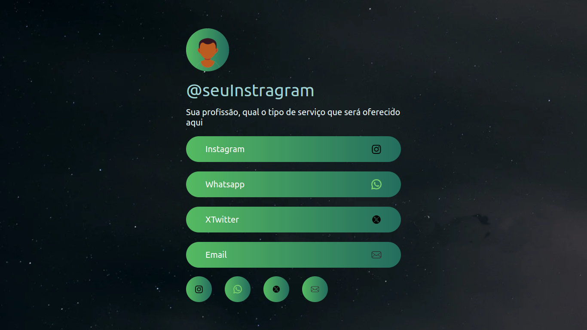
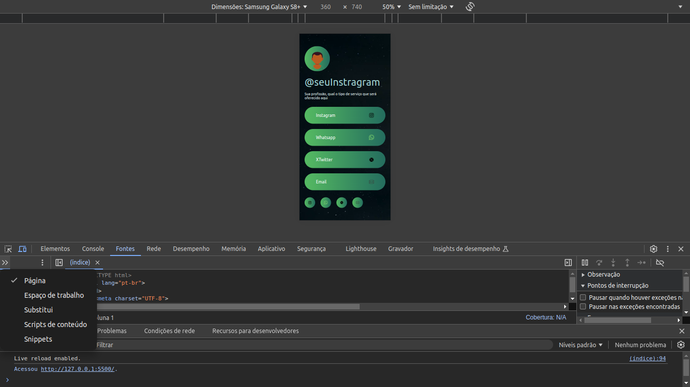

# Projeto Contatos para Serviços



Um projeto como seu Cartão de Visita, para o seu possivel cliente 💲.

## Indíce

- <a href="#-tecnologias-utilizadas"> Tecnologias utilizadas
- <a href="#-layout"> Layout
- <a href="#-rodar"> Como rodar o projeto
- <a href="#-autores"> Autores

## 📱 Funcionalidades do projeto 

- [x] Conectar o cliente no Instagram
- [x] Conectar o cliente no Whatsapp
- [x] Conectar o cliente no X
- [x] Direcionar o cliente para o seu Email

## 📋 Layout 




## Como rodar o projeto?

```BASH
# Clone este repositório
$ git clone contatos_servicos

# Abra o repositório com seu VS Code, o pronto para ser alterados !
```

## ⚙️ Tecnologias utilizadas


1.[HTML5](https://pt.wikipedia.org/wiki/HTML)

2.[CSS](https://pt.wikipedia.org/wiki/Cascading_Style_Sheets)

## ✔️ Autores

<p> Eu <strong><i> Diego Fonseca Calado </i></strong> desenvolvi este projeto como base de um estudo.</a>